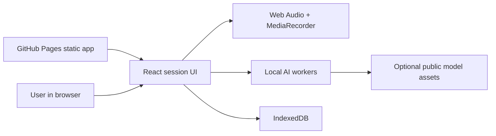

# Bilateral Memory Processing


Live site:

https://baditaflorin.github.io/bilateral-memory-processing/

Repository:

https://github.com/baditaflorin/bilateral-memory-processing

Support:

https://www.paypal.com/paypalme/florinbadita

Private browser-based EMDR-inspired audio journaling with local transcription, reflection prompts, and no trauma uploads.


## What It Does

- Plays alternating left/right headphone tones with Web Audio.
- Records microphone audio locally with MediaRecorder.
- Runs local reflection guidance in a worker, with optional WebLLM when the browser supports it.
- Runs Whisper transcription locally through `@huggingface/transformers` after user action.
- Speaks guidance through Piper WASM when available.
- Saves private session notes only in this browser through IndexedDB.

This is not clinical treatment, diagnosis, emergency support, or a replacement for a licensed professional.

## Quickstart

```sh
npm install
make install-hooks
make dev
make test
make smoke
```

## Architecture



Sensitive session content stays inside the browser. Optional model downloads fetch static assets only; the app does not upload audio, transcripts, distress ratings, or notes.

## Documentation

Architecture:

https://github.com/baditaflorin/bilateral-memory-processing/blob/main/docs/architecture.md

ADRs:

https://github.com/baditaflorin/bilateral-memory-processing/tree/main/docs/adr

Deployment:

https://github.com/baditaflorin/bilateral-memory-processing/blob/main/docs/deploy.md

Privacy:

https://github.com/baditaflorin/bilateral-memory-processing/blob/main/docs/privacy.md

Postmortem:

https://github.com/baditaflorin/bilateral-memory-processing/blob/main/docs/postmortem.md

## Local Commands

```sh
make help
make build
make pages-preview
make lint
make release
```
