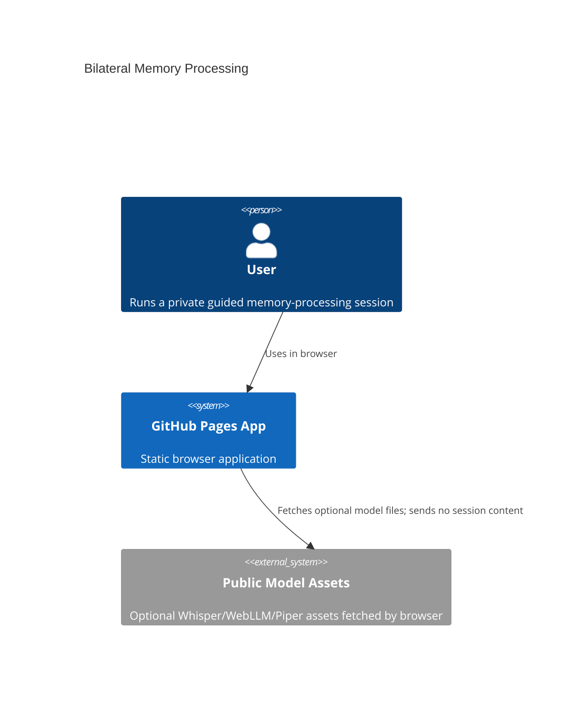
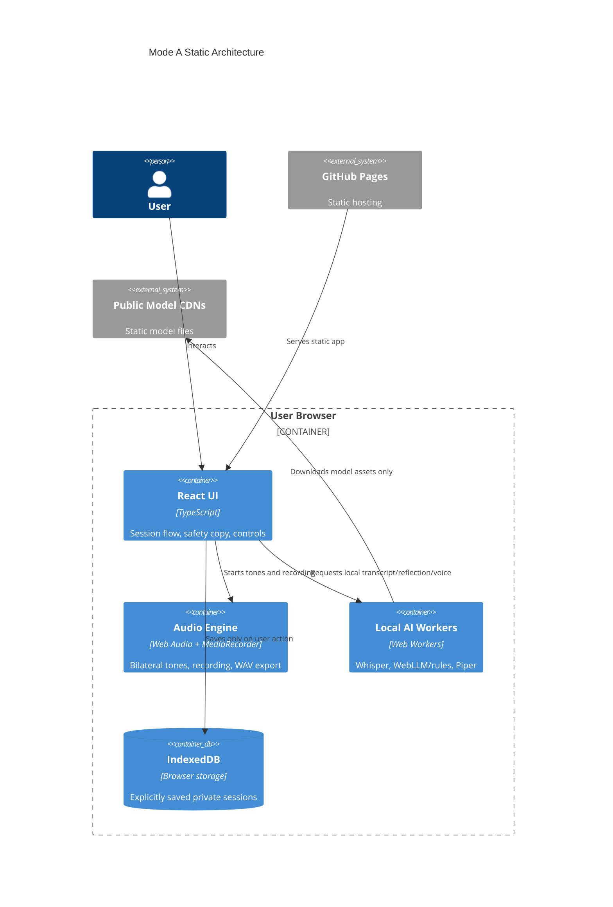

# Architecture

Live site:

https://baditaflorin.github.io/bilateral-memory-processing/

Repository:

https://github.com/baditaflorin/bilateral-memory-processing

## Context

## Container

The GitHub Pages boundary contains static HTML, CSS, JS, and assets only. Sensitive session content stays inside the user browser.
